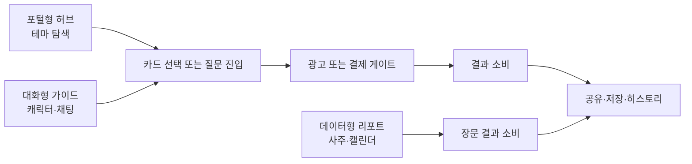
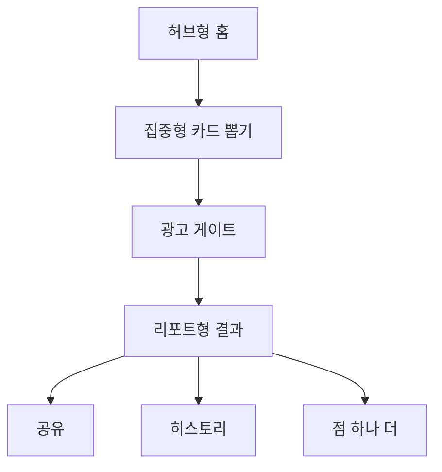

# 타로와 사주 서비스 레이아웃 리서치와 반응형 개선 제안

## Executive summary

국내 운세 서비스의 공개 화면을 보면 큰 흐름은 세 갈래로 나뉜다. entity["organization","점신","fortune platform korea"]과 entity["organization","포스텔러","fortune platform korea"]는 많은 테마를 빠르게 훑게 만드는 **포털형 허브**이고, entity["organization","헬로우봇","fortune chatbot app korea"]은 감정 몰입을 만드는 **대화형 가이드**이며, entity["organization","우주고양이 보라","fortune app korea"]는 캐릭터와 일상 운세를 앞세운 **안심형 진입 구조**에 가깝다. 공식 소개 기준으로 점신은 1900만 이용자를, 헬로우봇은 누적 600만 다운로드를, 포스텔러는 누적 사용자 900만을, 보라는 2년 만에 100만 사용자를 각각 내세운다. citeturn1search2turn1search1turn19search4turn14search0

레이아웃 관점에서 가장 중요한 결론은 단순하다. **모바일에서 빨리 시작하게 하고, 데스크톱에서는 넓어진 공간을 “더 많은 장식”이 아니라 “더 나은 구조”에 써야 한다.** 국내 주요 서비스의 공식 스크린샷은 실제로 테마 탐색, 카드 선택, 결과 소비를 위한 명확한 카드/리스트/채팅 구조를 전면에 두고 있으며, 과도한 우주 배경이나 네온 효과보다 콘텐츠 구조가 먼저 읽히게 설계되어 있다. citeturn18view1turn18view4turn24view1turn24view2turn23view5

사용자 제공 문서상 entity["organization","점하나","tarot app mvp"]는 홈 → 카드 뽑기 → 광고 → AI 해석 결과 → 공유의 선형 플로우, 탭바 없는 구조, 가벼운 신비감과 친구 같은 톤, 모바일 우선 반응형 웹앱을 전제로 한다. 그래서 가장 현실적인 해법은 **홈은 허브형, 카드 뽑기는 집중형, 결과는 리포트형**으로 조합하고, 채팅형은 결과 문장의 “단계적 리빌”만 제한적으로 빌려오는 방식이다. 이 조합이 한국 서비스 문법과 접근성 기준, 그리고 현재 기획을 가장 덜 어긋나게 잇는다. fileciteturn0file1 fileciteturn0file2 fileciteturn0file6 fileciteturn0file8

반응형 기준은 한국 공공 디자인 시스템인 entity["organization","KRDS","design system korea"]의 표준형 그리드를 그대로 차용하는 편이 안전하다. small 360px+는 4컬럼·16px 마진, medium 768px+는 8컬럼·24px 마진, large 1024px+는 12컬럼·24px 마진이 기본이며, large 이상부터는 좌우 보조 패널을 허용하는 서브 페이지 레이아웃이 권장된다. 접근성 최소선은 텍스트 명도 대비 4.5:1, 비텍스트 컨트롤 3:1, 터치 타깃 44×44px, 단일 포인터 대체 가능, 포인터 취소 가능, 광고와 콘텐츠의 명확한 분리다. citeturn25view0turn25view1turn25view3turn27view0turn16view3turn26view5turn26view3turn16view5

## 리서치 범위와 스크린샷 출처

이 보고서는 한국 주요 운세 서비스의 **공식 홈페이지·공식 앱 스토어 원문·공식 스크린샷**을 우선 사용했고, 그 위에 사용자 제공 벤치마킹/기획 문서를 겹쳐 해석했다. 일부 서비스는 웹 HTML에서 세부 상호작용이 충분히 노출되지 않아, 공개 스크린샷과 내부 벤치마킹 문서로 보완했다. 데스크톱 상세 행태는 서비스마다 공개 정보가 달라 일부는 **가정**으로 표기했다. citeturn1search2turn1search1turn19search4turn17search7turn2view4 fileciteturn0file0

위의 스크린샷 묶음은 실제 비교에 사용한 공식 앱 스토어 캡처 일부다. 출처는 아래 표에 정리했다.

| 서비스 | 캡처에서 확인한 패턴 | 원문 페이지 |
|---|---|---|
| **entity["organization","점신","fortune platform korea"]** | 테마 카드가 많이 노출되는 카테고리 그리드, 오늘 운세 리스트형 요약 화면 | 공식 사이트/공식 앱 페이지 citeturn1search2turn7view2turn18view1turn18view4 |
| **entity["organization","헬로우봇","fortune chatbot app korea"]** | 채팅형 해석 카드, 상황별 스킬 스토어 카드 리스트 | 공식 사이트/공식 앱 페이지 citeturn1search1turn6view0turn24view1turn24view2 |
| **entity["organization","포스텔러","fortune platform korea"]** | 다량의 운세 카테고리를 한 번에 소화하는 허브형 그리드 | 공식 사이트/공식 앱 페이지 citeturn19search4turn20view0turn23view5 |
| **entity["organization","우주고양이 보라","fortune app korea"]** | 캐릭터 중심·따뜻한 메시지 중심의 운세 앱 포지셔닝 | 공식 앱 페이지 citeturn14search0turn14search1 |

## 국내 주요 서비스에서 읽히는 레이아웃 패턴

사용자 제공 벤치마킹 문서에 따르면 점신은 “타로홈 → 테마 선택 → 카드 3장 선택 → 로딩/광고 → 결과”의 무료·광고형 선형 구조를, 헬로우봇은 “스킬 스토어 → 이름 입력 → 광고/결제 게이트 → 채팅형 해석” 구조를 사용한다. 점하나의 현재 기획 역시 홈 → 카드 뽑기 → 광고 → AI 결과 → 공유의 선형 구조다. 즉, 당신 프로젝트는 이미 국내 강자들이 검증한 흐름 위에 서 있다. 문제는 흐름이 아니라 **레이아웃을 얼마나 덜 피곤하게, 덜 AI스럽게, 더 읽기 쉽게 정리하느냐**다. fileciteturn0file0 fileciteturn0file1

| 패턴군 | 대표 서비스 | 첫 화면 구조 | 결과 소비 방식 | 수익화와 결합 방식 | 장점 | 리스크 |
|---|---|---|---|---|---|---|
| 포털형 허브 | 점신, 포스텔러 | 퀵 진입, 카테고리 탭/칩, 다량의 테마 카드 그리드 | 탭형·리포트형·요약형 | 광고/유료 콘텐츠가 콘텐츠 흐름 사이에 삽입 | 탐색성과 재방문성이 높고, 무료 다회 이용에 강함 | 첫 화면 과밀, 광고와 콘텐츠 혼동, 데스크톱에서 “늘린 모바일”처럼 보일 위험 |
| 대화형 가이드 | 헬로우봇 | 스킬 스토어, 캐릭터/상황 카드, 질문 유도 | 채팅 버블, 단계적 리빌, 반응 유도 | 광고 게이트나 소액 결제를 진입부·중간에 배치 | 감정 몰입, AI/캐릭터 해석과 궁합이 좋음 | 스캔 속도가 느리고, 데스크톱 확장이 어려우며, 결과를 한눈에 비교하기 힘듦 |
| 캐릭터 안심형 | 우주고양이 보라 | 오늘의 운세, 친근한 캐릭터, 따뜻한 메시지 | 일상적 카피 중심의 짧은 리딩 | 무료 진입 후 리텐션/유료 확장 | 심리적 진입장벽이 낮음 | 너무 귀여우면 신뢰감이 줄고, 데스크톱에서 가벼워 보일 수 있음 |

점신은 공식 사이트에서 1900만 이용자를 내세우고, Google Play에서 500만+ 다운로드와 광고 포함 인앱 구매를 표시한다. 헬로우봇은 공식 사이트에서 누적 600만 다운로드를, Google Play에서 100만+ 다운로드와 200개 이상의 무료 사주·타로, AI 챗봇 상담을 강조한다. 포스텔러는 공식 사이트에서 900만 사용자와 홈페이지 내 서비스 허브를, Google Play에서 100만+ 다운로드와 6,000건 이상 운세, 46개 주제/장르, 운세 캘린더를 강조한다. 이 세 서비스만 봐도 “카드/리스트/리포트”의 구조적 위계가 공통점이며, 화려한 시각 효과는 부차적이다. citeturn1search2turn7view2turn1search1turn6view0turn19search4turn20view0

포스텔러 리뷰에는 “아기자기한 이미지 활용이 많아 페이지 전환 속도가 다소 느린감이 있다”는 사용 후기가 보인다. 이건 데이터가 아니라 **사용자 피드백**이지만, 이미지와 카드가 늘어나면 체감 속도와 인지 부하가 나빠질 수 있다는 경고로는 충분하다. 즉, “예뻐 보이려고 넣은 장식”이 실제 KPI를 깎을 수 있다. citeturn20view0

한국형 서비스 문법을 더 단순하게 정리하면 아래 흐름으로 요약할 수 있다.



이 구조를 그대로 따라가되, 첫 화면에서 사용자가 해야 할 일을 한 번에 하나씩만 보이게 만들면 된다. 국내 주요 서비스는 겉보기에는 복잡하지만 실제로는 **첫 행동 하나를 강하게 밀고**, 상세 정보는 아래로 미루는 방식으로 작동한다. 그 “첫 행동”이 보이지 않는 순간 AI스러운 장식 UI가 된다. citeturn18view1turn24view2turn23view5turn28view1

## 반응형 개선 원칙

기준 그리드는 KRDS 표준형 스타일을 그대로 가져오는 편이 가장 안전하다. KRDS는 small 360px+에서 4컬럼·16px 마진, medium 768px+에서 8컬럼·24px 마진, large 1024px+에서 12컬럼·24px 마진, xlarge 1280px+에서도 12컬럼·24px 마진을 제시한다. 또한 large 이상부터는 본문 옆에 보조 메뉴를 두는 서브 페이지 레이아웃을 사용할 수 있다고 명시한다. 그래서 모바일은 **한 줄 한 기능**, 데스크톱은 **중앙 본문 + 보조 패널**로 가는 것이 정석이다. citeturn25view0turn25view1turn25view3

| 브레이크포인트 | 기본 컬럼 | 가터 | 최소 스크린 마진 | 타로·사주 화면 적용 권장 |
|---|---:|---:|---:|---|
| 360px+ | 4 | 16px | 16px | 홈, 카드 선택, 결과를 기본적으로 1열 중심으로 설계 |
| 768px+ | 8 | 16px | 24px | 리스트와 본문을 2영역으로 나누기 시작 |
| 1024px+ | 12 | 24px | 24px | 결과 본문 + 요약 패널, 또는 필터 + 콘텐츠 + 보조 패널 |
| 1280px+ | 12 | 24px | 24px | 중앙 max-width 유지, 좌우를 보조 정보에 사용 |

폼과 입력 구조도 중요하다. KRDS는 입력폼 콘텐츠를 여러 열에 무리하게 흩뿌리기보다 가능한 한 하나의 열에 수직 정렬하는 것이 권장된다고 설명한다. 타로 질문 선택, 생년월일 입력, 결과 섹션 토글은 특히 이 원칙을 그대로 따르는 편이 안전하다. **작은 화면에서 좌우로 갈라진 양식은 거의 항상 읽기와 입력 둘 다 망친다.** citeturn16view2

접근성 관점에서 이번 프로젝트에 특히 중요한 항목은 KWCAG 2.2의 신규 항목들이다. 단일 포인터 입력 지원, 포인터 입력 취소, 레이블과 네임, 찾기 쉬운 도움 정보가 추가되었고, 모바일 앱 접근성 지침 2.0은 별도로 19개 항목을 제공한다. 카드 선택이 스와이프, 드래그, 길게 누르기에 기대면 안 되는 이유가 여기 있다. 카드 선택은 반드시 **탭 한 번으로도 가능**해야 하고, 실수 선택은 취소 가능해야 하며, 아이콘 버튼에는 눈으로도 읽히는 레이블이 있어야 한다. citeturn16view0turn26view5turn26view3turn17search0turn17search1turn17search7

광고는 더 단순하다. entity["company","Google AdSense","ad network"]는 사용자가 원하는 콘텐츠를 쉽게 찾을 수 있게 구성하라고 권장하고, 광고와 주변 콘텐츠를 구분하라고 명시한다. 광고 카드가 테마 카드처럼 보이면 안 되고, 이미지와 광고를 나란히 두어 클릭을 오인시키는 배치도 피해야 한다. 운세 서비스는 본질적으로 카드와 광고가 둘 다 “직사각형 박스”이기 때문에 이 규칙을 어기기 쉽다. **광고 박스를 카드처럼 꾸미는 순간 접근성과 정책을 동시에 잃는다.** citeturn16view5

정리하면 반응형 개선의 핵심은 다섯 가지다. 첫째, 모바일을 데스크톱으로 단순 확대하지 않는다. 둘째, 데스크톱의 여백은 장식이 아니라 요약/필터/히스토리 패널에 쓴다. 셋째, 스와이프·툴팁·아이콘만으로 기능을 숨기지 않는다. 넷째, 텍스트는 실텍스트로 두고 대비를 확보한다. 다섯째, 광고는 행동 이후에, 그리고 콘텐츠와 분리해 둔다. citeturn28view4turn27view0turn16view3turn16view5

## 반응형 레이아웃 템플릿

아래 3종은 “모바일-first → 데스크톱 적응”을 전제로 한 실제 템플릿이다. 셋 다 한국 서비스 문법을 참고했지만 역할이 다르다. 한 가지로 모든 화면을 통일하려 하지 말고, **홈·카드 뽑기·결과**에서 서로 다른 템플릿을 조합하는 편이 훨씬 현실적이다. 점하나에는 템플릿 1과 3의 조합이 기본 추천이며, 템플릿 2는 결과 문장 리빌 패턴만 부분 차용하는 편이 맞다. fileciteturn0file1 fileciteturn0file2 fileciteturn0file6

| 템플릿 | 모바일 구조 | 데스크톱 구조 | 가장 잘 맞는 시나리오 | 장점 | 단점 |
|---|---|---|---|---|---|
| 허브형 카드 월 | 퀵 진입 + 카테고리 칩 + 테마 카드 리스트 | 좌측 필터 / 중앙 카드 월 / 우측 최근·배너 | 무료 다회 이용, 광고 기반, SEO/탐색 중시 | 첫 체험 빠름, 유입 다양성 높음 | 초기 과밀 위험 |
| 대화형 가이드 스튜디오 | 진행 헤더 + 채팅 + 한 단계 CTA | 좌측 대화 흐름 / 우측 카드 또는 요약 패널 | 캐릭터·AI 몰입, 유료/프리미엄 해석 | 감정 몰입, 개인화 체감 좋음 | 스캔 속도 느림, 탐색성 약함 |
| 리포트형 리딩 데스크 | 요약 카드 + 섹션 접기/펼치기 | 좌측 목차 / 중앙 본문 / 우측 카드 요약·행동 | 결과 정독, 사주·장문 리포트, 공유/저장 | 데스크톱 활용도 높고 읽기 좋음 | 설계가 엉성하면 차갑고 무거워짐 |

### 템플릿 허브형 카드 월

이 템플릿은 점신과 포스텔러의 “많은 운세를 빠르게 고르게 만드는 구조”를 정리한 버전이다. 핵심은 **첫 뷰포트의 혼잡도를 줄이되, 탐색의 폭은 유지하는 것**이다. 카드가 많아도 괜찮다. 대신 첫 화면에서 사용자가 실제로 읽어야 하는 문구는 적어야 한다. citeturn18view1turn23view5turn28view1

| 구분 | 모바일 쌍 | 데스크톱 쌍 |
|---|---|---|
| 헤더 | 로고, 히스토리, 검색 또는 더보기 중 하나만 | 좌측 로고, 중앙 카테고리, 우측 히스토리/로그인 |
| 첫 화면 | 오늘의 타로·이번 주 타로 퀵 CTA 2개 + 카테고리 칩 + 테마 카드 1~2열 | 좌측 카테고리/필터 240px, 중앙 테마 카드 3~4열, 우측 최근 본 결과/추천 280px |
| 탐색 | 수직 스크롤 하나로 해결 | 카드 월은 중앙 고정폭, 우측 패널은 sticky |
| 광고 | 두 번째 콘텐츠 블록 이후 배너 1개 | 우측 패널 하단 또는 카드 월 중간 1개, 콘텐츠와 시각 분리 |

장점은 강력하다. 첫 방문자가 “무엇을 할 수 있는지”를 바로 본다. 검색 유입과 공유 유입 모두 흡수하기 좋고, 무료 다회 이용 모델과 궁합이 좋다. 반대로 단점도 분명하다. 카드가 많아질수록 사용자가 어디부터 눌러야 할지 모르게 된다. 그래서 첫 화면에는 **퀵 액션 2개, 카테고리 칩 5개 내외, 테마 카드 6~8개 정도만 선노출**하고 나머지는 뒤로 미뤄야 한다는 것이 핵심이다. 이는 KRDS의 “링크 개수 최소화”, “구조화 목록의 위계화” 원칙과도 맞는다. citeturn16view4turn28view1turn28view0

우선 구현 컴포넌트는 다음 순서를 추천한다.

1. 헤더 로고 + 히스토리 버튼  
2. 퀵 진입 CTA 카드 2종  
3. 카테고리 칩 바  
4. 구조화된 테마 카드  
5. 최근 본 결과 미니 리스트  
6. 광고 슬롯 컴포넌트  
7. 빈 상태 / 에러 상태 카드

### 템플릿 대화형 가이드 스튜디오

이 템플릿은 헬로우봇식 몰입을 반응형으로 바꾼 버전이다. 모바일에서는 잘 맞지만, 데스크톱으로 넘어가면 “채팅창 하나가 가운데 덩그러니 있는 화면”이 되기 쉽다. 그래서 데스크톱에서는 반드시 **대화 영역 + 카드/결과 보드**의 분할이 필요하다. citeturn24view1turn24view2turn24view3

| 구분 | 모바일 쌍 | 데스크톱 쌍 |
|---|---|---|
| 헤더 | 현재 단계, 뒤로가기, 종료 또는 도움말 | 좌측 대화 제목, 우측 진행률과 저장 |
| 본문 | 채팅 버블 + 선택지 CTA + 카드 선택 패널 | 좌측 채팅 흐름 5컬럼, 우측 카드 보드/요약 7컬럼 |
| 결과 | 한 번에 다 보이지 않고 단계별 리빌 | 좌측은 설명, 우측은 카드 이미지/요약 정리 |
| 광고 | 채팅 도중 삽입 금지, 단계 완료 직후만 | 결과 진입 직전 또는 하단 분리 영역 |

장점은 “AI가 읽어준다”는 감정을 가장 잘 만든다는 점이다. 특히 작은 화면에서 긴 결과를 한 번에 던지지 않고, 문단을 잘라 보여줄 때 효과가 좋다. 단점은 효율이 떨어진다는 것이다. 비교해 보거나 다시 훑는 데 불리하고, 첫 화면에서 콘텐츠의 breadth를 보여주기도 어렵다. 그래서 무료 포털형 홈 전체를 이 템플릿으로 통일하면 답답해진다. **결과 화면 일부에만 적용해야 한다.** citeturn24view1turn24view3turn6view0

우선 구현 컴포넌트는 다음 순서를 추천한다.

1. 진행 헤더  
2. 캐릭터/시스템 메시지 버블  
3. 단일 CTA 선택지 버튼  
4. 카드 선택 드로어 또는 보드  
5. 타이핑/스트리밍 블록  
6. 반응 버튼 또는 “다음 보기” 버튼  
7. 종료/저장/공유 액션 바

### 템플릿 리포트형 리딩 데스크

이 템플릿은 타로 결과와 사주 리포트에 가장 잘 맞는다. 모바일에서는 “짧은 요약 → 접힌 섹션들 → 하단 행동” 구조로, 데스크톱에서는 “목차/요약/본문”의 삼분 구조로 읽기 경험을 최적화한다. 이 방식은 포스텔러의 리포트/캘린더형 정보 구조와, 점하나의 AI 스트리밍 결과 설계가 만나는 지점이다. citeturn20view0turn23view5 fileciteturn0file1 fileciteturn0file2

| 구분 | 모바일 쌍 | 데스크톱 쌍 |
|---|---|---|
| 상단 | 카드 3장 요약, 한 줄 결론, 공유 버튼 | 좌측 목차 220px, 중앙 본문 680~760px, 우측 카드 요약/공유 260~320px |
| 본문 | 과거/현재/미래/종합 조언 아코디언 또는 구획 블록 | 목차 링크로 섹션 점프, 긴 본문에도 현재 위치 유지 |
| 보조 정보 | 저장, 다시 보기, 비슷한 테마 | 우측 sticky 행동 패널, 최근 결과, 비교 보기 |
| 광고 | 본문 문단 사이 삽입 금지, 섹션 끝 단위만 | 우측 패널 하단 또는 본문 끝단 1개 |

장점은 읽기와 공유, 저장, 재방문에 모두 강하다는 것이다. 사주처럼 정보가 깊어질수록 데스크톱 활용도도 높아진다. 단점은 잘못 만들면 너무 딱딱하고 “문서 느낌”만 남는다는 점이다. 그래서 카드 요약, 한 줄 해석, 작은 일러스트 같은 감성 장치를 **본문 밖에만** 얹는 것이 중요하다. 본문 자체는 차분해야 한다. 포스텔러 사용자 리뷰에서 느린 전환을 지적한 것처럼, 여기서도 장식이 많아지면 읽기 효율이 바로 떨어진다. citeturn20view0

우선 구현 컴포넌트는 다음 순서를 추천한다.

1. 카드 요약 스트립  
2. 결과 섹션 아코디언 / 본문 블록  
3. 데스크톱 목차 패널  
4. 공유/저장/다시 보기 액션 클러스터  
5. 히스토리 미니 리스트  
6. 광고 슬롯  
7. 인쇄/복사 친화형 텍스트 스타일

현재 점하나 문서 기준으로 추천 조합은 아래와 같다.



이 조합은 점하나의 선형 플로우와 광고 구조를 유지하면서도, 홈에서의 탐색성과 결과에서의 정독성을 동시에 챙긴다. 채팅형은 결과의 첫 2~3문단 정도를 순차 노출하는 데만 쓰면 된다. 전 화면을 채팅형으로 만드는 건 과하다. fileciteturn0file1 fileciteturn0file2

## 접근성 체크리스트

접근성은 “장애 대응”만이 아니라, 운세 서비스에서 흔한 **읽기 피로·오탭·광고 오인·길 잃음**을 줄이는 가장 직접적인 방법이다. 아래 체크리스트는 KWCAG 2.2, 모바일 앱 접근성 지침 2.0, KRDS, 광고 배치 가이드를 합쳐 타로·사주 서비스에 맞춘 것이다. citeturn16view0turn17search0turn17search1turn27view0turn16view5

| 영역 | 체크 항목 | 최소 기준 | 근거 |
|---|---|---|---|
| 가독성 | 본문 텍스트와 배경 대비 | 4.5:1 이상 | citeturn27view0 |
| 가독성 | 아이콘/토글/선택 상태 대비 | 3:1 이상 | citeturn27view0 |
| 가독성 | 텍스트가 들어간 이미지를 본문으로 사용하지 않기 | 카드 UI 안 장식 텍스트 제외, 해석 본문은 실텍스트 | citeturn27view0 |
| 탐색 | 메뉴/탭 활성 상태를 색상만으로 구분하지 않기 | 아이콘 또는 밑줄, 굵기, 형태 병행 | citeturn27view0turn28view0 |
| 탐색 | 탭바를 쓰는 경우 항목 수 제한 | 5개 이내 | citeturn28view0 |
| 탐색 | 링크 수 최소화와 쉬운 용어 사용 | 첫 뷰포트 액션 최소화 | citeturn16view4 |
| 탐색 | 모바일 폼/질문 입력은 단일 열 정렬 | 1열 우선, 관련 항목만 가로 배치 | citeturn16view2 |
| 터치 영역 | 버튼/칩/카드의 반응 면적 확보 | 44×44px 이상 | citeturn16view3turn28view3 |
| 제스처 | 스와이프/드래그의 탭 대체 제공 | 카드 선택은 탭으로도 가능해야 함 | citeturn26view5 |
| 오조작 방지 | 다운 이벤트에서 즉시 실행 금지 | 업 이벤트 완료 또는 실행 취소 제공 | citeturn26view3 |
| 라벨 | 아이콘 버튼과 입력 요소에 이름 제공 | role/name/label 명확화 | citeturn16view3turn11search5turn27view0 |
| 상태 전달 | 로딩/스트리밍 상태를 음성으로도 전달 | 스피너 설명 또는 상태 메시지 제공 | citeturn27view0 |
| 도움 정보 | 툴팁 의존 금지 | 터치 환경에서는 보이는 텍스트나 팝오버로 대체 | citeturn28view4 |
| 광고 배치 | 광고와 콘텐츠를 시각적으로 분리 | “광고/스폰서드” 레이블, 콘텐츠 카드와 다른 스타일 | citeturn16view5 |
| 광고 배치 | 첫 핵심 행동 전에 전면 광고 노출 자제 | 카드 선택 완료 등 의도 신호 이후에만 | citeturn16view5 fileciteturn0file0 fileciteturn0file1 |

추가로, 모바일 앱 접근성 지침 2.0은 총 19개 항목을 제공한다. 타로 서비스처럼 감성 UI가 강한 제품일수록 기본적인 라벨, 초점, 상태 전달, 조작 가능 항목을 놓치기 쉽다. 실제 구현에서는 “보이는 예쁨”보다 먼저 “누가 눌러도 실수 없이 작동하는가”를 체크해야 한다. citeturn17search0turn17search1turn17search7

## KPI 개선 포인트

아래 내용은 **가정 기반의 개선 가설**이다. 실제 값은 당신 서비스의 유입 채널, 광고 강도, AI 응답 속도에 따라 달라질 수 있다. 다만 현 구조와 국내 벤치마크를 보면 어떤 레이아웃 조정이 어떤 KPI에 영향을 줄 가능성이 높은지는 충분히 예측할 수 있다. fileciteturn0file0 fileciteturn0file1 fileciteturn0file2

| KPI | 현재 흔한 리스크 | 레이아웃 개선 포인트 | 측정 이벤트 제안 | 기대 방향 |
|---|---|---|---|---|
| 이탈률 | 첫 화면이 과밀하고 첫 행동이 안 보임 | 첫 뷰포트에 퀵 스타트 1~2개만 강하게 노출, 나머지는 아래로 미룸 | `home_view`, `quick_start_click`, `theme_card_click`, `bounce_by_viewport` | **감소 가설** |
| 이탈률 | 광고가 너무 빨리 나오거나 콘텐츠처럼 보임 | 광고는 카드 선택 완료 뒤에만, 카드와 전혀 다른 스타일로 분리 | `ad_impression`, `ad_close`, `result_view_after_ad` | **감소 가설** |
| 체류시간 | 결과가 한 번에 길게 쏟아져 읽기 포기 | 카드 요약 → 짧은 결론 → 섹션별 본문 순서로 구조화 | `result_view`, `section_expand`, `scroll_50`, `scroll_80` | **증가 가설** |
| 체류시간 | 홈에서 너무 많은 선택지로 길 잃음 | 허브형 홈에서는 카테고리 칩 + 추천 카드만 선노출 | `category_filter_use`, `card_detail_view`, `history_open` | **질 중심 증가 가설** |
| 전환 | 무료 이용은 했지만 공유/저장으로 이어지지 않음 | 결과 상단에 한 줄 요약과 공유 CTA를 고정 | `share_click`, `copy_link`, `save_result` | **증가 가설** |
| 전환 | AI 결과 이전 이탈 | 카드 선택 후 바로 공통 로딩/광고 게이트 → 결과로 단일 전환 | `card_select_complete`, `gate_enter`, `result_render_complete` | **증가 가설** |
| 재방문 | 이전 결과를 찾기 어려움 | 홈 우측 패널 또는 모바일 하단에 최근 결과 3개 요약 | `history_open`, `history_item_click`, `return_user_7d` | **증가 가설** |
| 수익 | 홈/결과에 광고가 섞여 CTR은 나와도 만족도 하락 | 광고를 콘텐츠처럼 “숨기지 말고” 정면으로 분리, intent 이후 삽입 | `ad_ctr`, `result_exit_rate`, `user_feedback_negative` | **질적 개선 가설** |

이탈률 관점에서 가장 큰 레버는 **첫 결정까지 걸리는 시간**이다. KRDS가 링크 수 최소화와 구조화 목록의 위계를 강조하는 이유도 여기에 있다. 홈에서 “오늘의 타로 보기”나 “이번 주 타로 보기” 같은 즉시 행동형 CTA를 먼저 두고, 나머지 넓은 탐색은 그 아래에 배치하면 좋다. 점하나 문서에 이미 이 구조가 들어 있으니, 문제는 기능 추가가 아니라 **첫 화면 압축**이다. citeturn16view4turn28view1 fileciteturn0file1

체류시간은 카드 선택 화면보다 **결과 화면의 구조화 수준**에 더 민감할 가능성이 높다. 헬로우봇의 단계별 리빌 방식과 점하나의 AI 스트리밍 결과 설계를 섞어, 결과를 “한 번에 다 보여주는” 대신 “먼저 카드 요약과 한 줄 결론을 노출하고, 이후 섹션별로 읽게 만드는” 편이 낫다. 이것은 몰입과 읽기 완주율을 동시에 노리는 방식이다. 다만 전체 결과를 숨기는 채팅형으로만 가면 나중에 다시 읽기 어렵다. citeturn24view1turn24view3 fileciteturn0file2

전환은 “좋았던 경험 뒤에 바로 행동을 놓느냐”에 달려 있다. 공유, 저장, 다시 보기, 히스토리 진입은 결과를 읽기 시작한 직후 가장 힘이 세다. 반대로 홈이나 광고 이전에 프리미엄 업셀을 밀면 설득력이 떨어진다. 현재 점하나 구조처럼 광고는 카드 선택 완료 후, 공유/저장은 결과 상단 근처에 두는 편이 맞다. fileciteturn0file1 citeturn16view5

## Figma Make 프롬프트 세트

아래 프롬프트는 **결과 안정성**을 위해 영어로 썼고, 화면에 보이는 라벨은 한국어로 지시했다. 공통 프롬프트를 먼저 붙여넣고, 이어서 화면별 프롬프트를 사용하면 된다.

### 공통 시스템 프롬프트

```text
Create a responsive web app design for a Korean tarot and fortune service.

Generate both:
- mobile frame: 390x844
- desktop frame: 1440x1024

Responsive rules:
- mobile-first layout
- 4-column grid on mobile with 16px margins
- 8-column grid on tablet
- 12-column grid on desktop with 24px margins and gutters
- never stretch the mobile layout on desktop
- use adaptive regions such as left filter rail, center content area, and right sticky summary only when screen width is large enough

Visual direction:
- modern Korean editorial UI
- light mystical mood, not dark fantasy, not neon AI art
- clean surfaces, restrained illustration accents
- clear information hierarchy, real text blocks, visible labels
- high readability and strong contrast
- touch targets at least 44x44px
- obvious active states, focus states, and selected states
- ads must be visually distinct from content cards

Content direction:
- labels and visible text must be in Korean
- avoid generic AI-looking glowing panels
- prefer structured cards, chips, tabs, and readable sections
- use subtle character illustration only as a secondary accent
```

### 허브형 홈 화면

```text
Design the home screen of a Korean tarot web app.

Include both mobile and desktop versions.

Mobile layout:
- top header with logo "점하나" and history icon
- two quick action cards: "오늘의 타로", "이번 주 타로"
- horizontal category chips: 전체, 연애, 직장, 재물, 학업, 기타
- structured theme card list below
- each theme card includes title, short subtitle, and hashtag chips
- one clearly separated ad slot after the second content block
- clean vertical scroll

Desktop layout:
- centered max-width container
- left filter rail for categories
- center area with quick actions and theme card grid
- right sticky panel with recent readings and one separated promo/ad block
- do not use oversized hero art

Style:
- warm neutral background
- one restrained accent color
- subtle mystical illustration near the header only
- efficient, trustworthy, and not cluttered
```

### 카테고리 탐색 화면

```text
Design a responsive category browsing screen for a Korean tarot and fortune service.

Include both mobile and desktop frames.

Mobile:
- page title and currently selected category
- horizontal filter chips
- theme cards as a structured list, not decorative posters
- each card must have a clear CTA
- optional sort or filter row
- infinite scroll or load more area at bottom

Desktop:
- left category/filter rail
- center search + sort toolbar
- 3-column theme card grid
- right narrow panel for "최근 본 결과" and "추천 테마"
- cards should feel like readable content modules, not ads

Accessibility:
- visible selected state on category chips
- readable card titles
- enough spacing between cards
- avoid tiny tags and low-contrast gradients
```

### 카드 뽑기 화면

```text
Design a responsive three-card tarot selection screen.

Include both mobile and desktop versions.

Mobile:
- top progress header with current step
- three empty slots labeled "과거", "현재", "미래"
- center grid of 22 tarot card backs
- clear selected state when a card is chosen
- bottom sticky action bar with "다시 선택" and "결과 보기"
- selection must work by simple tap, not gesture only

Desktop:
- left panel with theme title, short instruction, and selected slots
- right panel with 22-card selection board
- bottom or side CTA area for reset and continue
- use whitespace to avoid card crowding

Style:
- focused experience
- minimal decoration
- subtle motion-ready layout without showing flashy game UI
- clear contrast between selected and unselected cards
```

### 광고 친화 로딩 화면

```text
Design a responsive loading screen placed between card selection and result.

Include both mobile and desktop versions.

Requirements:
- show a short loading state with calm branding
- include one clearly separated sponsored/ad area
- the ad area must never look like a tarot content card
- show a spinner or progress indicator with accessible status text
- keep the page simple and uncluttered

Mobile:
- centered loading animation
- status text below
- ad block separated by spacing and background tone

Desktop:
- centered loading module
- optional side panel or lower panel for ad placement
- preserve focus on the transition to result
```

### 리포트형 결과 화면

```text
Design a responsive tarot result screen focused on reading quality.

Include both mobile and desktop versions.

Mobile:
- card summary strip for 3 selected cards
- one-line takeaway at the top
- sections for "과거 해석", "현재 해석", "미래 해석", "종합 조언"
- sections may be collapsible
- share and save actions visible near the top and bottom
- one separated ad slot only after a full section

Desktop:
- left table of contents with section anchors
- center reading column with comfortable text width
- right sticky summary panel with card thumbnails, share, save, retry
- do not place ads inside paragraphs
- do not make desktop a stretched mobile page

Visual style:
- editorial reading interface
- highly readable typography
- calm, trustworthy, immersive but not dark
```

### 대화형 결과 변형 화면

```text
Design a responsive chat-lite result screen for a Korean tarot app.

Include both mobile and desktop versions.

Mobile:
- progress header
- conversation-style explanation blocks
- each block reveals one idea at a time
- card image or card summary appears before the final advice
- one main CTA per step
- no inline ad between message steps

Desktop:
- left column for conversation flow
- right column for card summary and final takeaway
- keep it readable and compact
- this is not a full messenger clone; it is a guided reading interface

Tone:
- warm, calm, lightly personal
- not childish
- not overly robotic
```

### 사주 리포트 대시보드 변형 화면

```text
Design a responsive saju report dashboard screen for a Korean fortune service.

Include both mobile and desktop versions.

Mobile:
- summary score cards
- date or period tabs
- compact report sections
- sticky bottom CTA for saving or sharing
- collapsible detail areas

Desktop:
- left navigation for report sections
- center main report content
- right panel for calendar, highlights, and actions
- suitable for long-form reading and comparison
- preserve a strong document structure

Style:
- modern editorial dashboard
- not finance-like, not fantasy-like
- calm icons, subtle traditional Korean visual reference
```

### 히스토리와 공유 결과 화면

```text
Design a responsive history and shared-result screen for a Korean tarot web app.

Include both mobile and desktop versions.

History screen:
- list of past readings with date, theme, and short summary
- clear empty state with friendly illustration
- each item is tappable
- mobile uses one-column list
- desktop uses list plus preview pane

Shared result screen:
- card summary
- one-line takeaway
- readable result sections
- clear CTA: "나도 점 하나 찍어볼까?"
- no confusing navigation
- suitable for social traffic landing

Accessibility:
- obvious item boundaries
- enough tapping space
- visible current item state
```

### 점하나에 바로 적용할 조합

```text
Create a responsive screen set for the MVP of "점하나".

Generate these screens in one coherent system:
1. hub-style home
2. focused three-card selection
3. ad-safe transition/loading
4. report-style result
5. history
6. shared result landing

Brand:
- friendly Korean tone
- light mysticism
- calm night mood without heavy darkness
- trustworthy and readable
- not AI-generic, not overly magical, not game-like

Responsive behavior:
- mobile-first
- desktop must use a centered content system with adaptive side panels
- preserve the same identity across sizes
- use reusable components and consistent spacing
```

이 프롬프트 세트는 “장식적인 AI 느낌”보다 **구조·가독성·행동 유도**를 먼저 잡기 위한 것이다. Figma Make에서 처음부터 완성형을 기대하지 말고, 홈·카드 선택·결과를 각각 생성한 뒤 컴포넌트 일관성을 다시 맞추는 순서로 가는 편이 더 낫다.